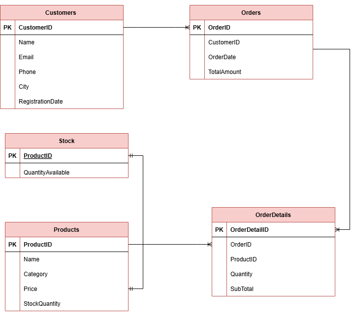

# Sales-DBMS

## Database Title
Sales Management & Analytics System

## Scope of Database
This system is designed to manage sales records in stores, including tracking customer, product, order, order details, and stock data. The database includes the following tables:

- **Customers**: Stores customer data (CustomerID, Name, Email, Phone, City, and Registration Date).
- **Products**: Stores product data (ProductID, Name, Category, and Price).
- **Orders**: Stores order data (OrderID, CustomerID, Order Date, and Total Amount).
- **OrderDetails**: Stores details of the products in each order (OrderID, ProductID, Quantity, and SubTotal).
- **Stock**: Stores available quantities for each product.

## Project Description
This system is aimed at managing customer, product, and order data in an organized and efficient manner, with the ability to track sales and perform analytics based on the data. The system includes functionalities such as:

- Adding customers and products.
- Placing orders and calculating total amounts.
- Updating stock quantities after each order.
- Generating reports like total sales per product and customer spending analysis.

## System Outputs
- **Display Customers**: View all customer records.
- **Display Products**: View all available products.
- **Display Order Details**: View details of each order, including products purchased.
- **Display Stock**: View the available quantities for each product.
- **Total Sales per Product**: View the total sales for each product.
- **Customer Spending Analysis**: View customers who have spent more than 5000 riyals.

## Stored Procedures and Triggers
- **Stored Procedure (`orders_procedure`)**: This stored procedure is used to add a new order, calculate the total amount for the order, and update the stock quantities.
- **Audit Trigger**: A trigger that logs changes (insert or delete) in the orders records into an audit table for tracking purposes.

## Technologies Used
- **SQL Server**: The database used for managing the data and executing queries.
- **Stored Procedures**: Used to handle operations like adding orders and calculating totals.
- **Triggers**: Used for auditing changes in order data.

## ER Diagram

